# Database

Source of truth: [`backend/prisma/schema.prisma`](../backend/prisma/schema.prisma).
Standalone SQL: [`backend/prisma/sql/schema.sql`](../backend/prisma/sql/schema.sql).

---

Full schema for the multi-vendor marketplace, matching
[`backend/prisma/schema.prisma`](../backend/prisma/schema.prisma)
and [`backend/prisma/sql/schema.sql`](../backend/prisma/sql/schema.sql)
table-for-table. Render with any Mermaid-compatible viewer (GitHub renders
this natively).

```mermaid
erDiagram
    USERS ||--o{ ACCOUNTS : has
    USERS ||--o{ SESSIONS : has
    USERS ||--o{ ADDRESSES : has
    USERS ||--o| ADMIN_PROFILES : has
    USERS ||--o| VENDOR_PROFILES : has
    USERS ||--o| CARTS : owns
    USERS ||--o| WISHLISTS : owns
    USERS ||--o{ ORDERS : places
    USERS ||--o{ SERVICE_BOOKINGS : books
    USERS ||--o{ PRODUCT_REVIEWS : writes
    USERS ||--o{ SHOP_REVIEWS : writes
    USERS ||--o{ COUPON_USAGES : redeems
    USERS ||--o{ ADVERTISEMENTS : creates
    USERS ||--o{ AD_EVENTS : triggers
    USERS ||--o{ NOTIFICATIONS : receives
    USERS ||--o{ AI_CHAT_SESSIONS : starts
    USERS ||--o| REFERRAL_CODES : owns
    USERS ||--o{ REFERRALS : refers
    USERS ||--o{ INVENTORY_LOGS : records

    VENDOR_PROFILES ||--o{ SHOPS : owns
    VENDOR_PROFILES ||--o{ COUPONS : issues

    SHOPS ||--o{ PRODUCTS : lists
    SHOPS ||--o{ SERVICES : offers
    SHOPS ||--o{ ORDER_ITEMS : fulfills
    SHOPS ||--o{ SHIPMENTS : ships
    SHOPS ||--o{ SHOP_REVIEWS : receives
    SHOPS ||--o{ COUPONS : issues
    SHOPS ||--o{ ADVERTISEMENTS : promotes
    SHOPS ||--o{ INVENTORY : stocks
    ADDRESSES ||--o{ SHOPS : located_at

    CATEGORIES ||--o{ CATEGORIES : parent_of
    CATEGORIES ||--o{ PRODUCTS : classifies
    CATEGORIES ||--o{ SERVICES : classifies

    PRODUCTS ||--o{ PRODUCT_IMAGES : has
    PRODUCTS ||--o{ PRODUCT_VARIANTS : has
    PRODUCTS ||--o{ PRODUCT_ATTRIBUTES : has
    PRODUCTS ||--o{ INVENTORY : tracked_by
    PRODUCTS ||--o{ CART_ITEMS : added_to
    PRODUCTS ||--o{ WISHLIST_ITEMS : saved_to
    PRODUCTS ||--o{ ORDER_ITEMS : sold_as
    PRODUCTS ||--o{ PRODUCT_REVIEWS : receives
    PRODUCTS ||--o{ ADVERTISEMENTS : promoted_by

    PRODUCT_VARIANTS ||--o| INVENTORY : tracked_by
    PRODUCT_VARIANTS ||--o{ CART_ITEMS : added_to
    PRODUCT_VARIANTS ||--o{ WISHLIST_ITEMS : saved_to
    PRODUCT_VARIANTS ||--o{ ORDER_ITEMS : sold_as

    SERVICES ||--o{ SERVICE_BOOKINGS : receives

    INVENTORY ||--o{ INVENTORY_LOGS : tracks

    CARTS ||--o{ CART_ITEMS : contains
    WISHLISTS ||--o{ WISHLIST_ITEMS : contains

    COUPONS ||--o{ COUPON_USAGES : redeemed_as
    COUPONS ||--o{ ORDERS : applied_to

    ORDERS ||--o{ ORDER_ITEMS : contains
    ORDERS ||--o{ PAYMENTS : paid_by
    ORDERS ||--o{ SHIPMENTS : shipped_via
    ORDERS ||--o| COUPON_USAGES : recorded_as
    ORDERS ||--o| REFERRALS : qualifies
    ADDRESSES ||--o{ ORDERS : ships_to
    ADDRESSES ||--o{ ORDERS : bills_to

    ORDER_ITEMS ||--o| PRODUCT_REVIEWS : reviewed_by
    ORDER_ITEMS ||--o{ SHIPMENT_ITEMS : packed_in

    PAYMENTS ||--o{ PAYMENT_REFUNDS : refunded_by

    SHIPPING_METHODS ||--o{ SHIPMENTS : used_by
    SHIPMENTS ||--o{ SHIPMENT_ITEMS : includes
    SHIPMENTS ||--o{ DELIVERY_TRACKING_EVENTS : tracked_by

    ADVERTISEMENTS ||--o{ AD_EVENTS : logs

    AI_CHAT_SESSIONS ||--o{ AI_CHAT_MESSAGES : contains

    REFERRAL_CODES ||--o{ REFERRALS : generates

    USERS {
        uuid id PK
        string email
        string role
        string status
    }
    ACCOUNTS {
        uuid id PK
        uuid user_id FK
        string provider
    }
    SESSIONS {
        uuid id PK
        uuid user_id FK
        string session_token
    }
    ADDRESSES {
        uuid id PK
        uuid user_id FK
        string type
        string city
    }
    ADMIN_PROFILES {
        uuid id PK
        uuid user_id FK
        string_array permissions
    }
    VENDOR_PROFILES {
        uuid id PK
        uuid user_id FK
        string business_name
        string status
    }
    SHOPS {
        uuid id PK
        uuid vendor_id FK
        uuid address_id FK
        string slug
        string status
    }
    CATEGORIES {
        uuid id PK
        uuid parent_id FK
        string slug
    }
    PRODUCTS {
        uuid id PK
        uuid shop_id FK
        uuid category_id FK
        string slug
        decimal base_price
        string status
    }
    PRODUCT_IMAGES {
        uuid id PK
        uuid product_id FK
        string url
    }
    PRODUCT_VARIANTS {
        uuid id PK
        uuid product_id FK
        string sku
        decimal price
    }
    PRODUCT_ATTRIBUTES {
        uuid id PK
        uuid product_id FK
        string name
        string value
    }
    SERVICES {
        uuid id PK
        uuid shop_id FK
        uuid category_id FK
        decimal price
    }
    SERVICE_BOOKINGS {
        uuid id PK
        uuid service_id FK
        uuid customer_id FK
        timestamp scheduled_at
        string status
    }
    INVENTORY {
        uuid id PK
        uuid product_id FK
        uuid variant_id FK
        uuid shop_id FK
        int quantity
    }
    INVENTORY_LOGS {
        uuid id PK
        uuid inventory_id FK
        uuid created_by_id FK
        string change_type
    }
    CARTS {
        uuid id PK
        uuid user_id FK
        string session_id
    }
    CART_ITEMS {
        uuid id PK
        uuid cart_id FK
        uuid product_id FK
        uuid variant_id FK
        int quantity
    }
    WISHLISTS {
        uuid id PK
        uuid user_id FK
    }
    WISHLIST_ITEMS {
        uuid id PK
        uuid wishlist_id FK
        uuid product_id FK
        uuid variant_id FK
    }
    COUPONS {
        uuid id PK
        uuid vendor_id FK
        uuid shop_id FK
        string code
        string type
    }
    COUPON_USAGES {
        uuid id PK
        uuid coupon_id FK
        uuid user_id FK
        uuid order_id FK
    }
    ORDERS {
        uuid id PK
        uuid customer_id FK
        uuid coupon_id FK
        uuid shipping_address_id FK
        uuid billing_address_id FK
        string order_number
        string status
        decimal total_amount
    }
    ORDER_ITEMS {
        uuid id PK
        uuid order_id FK
        uuid product_id FK
        uuid variant_id FK
        uuid shop_id FK
        int quantity
        string status
    }
    PAYMENTS {
        uuid id PK
        uuid order_id FK
        string provider
        string status
        decimal amount
    }
    PAYMENT_REFUNDS {
        uuid id PK
        uuid payment_id FK
        decimal amount
        string status
    }
    SHIPPING_METHODS {
        uuid id PK
        string name
        decimal base_cost
    }
    SHIPMENTS {
        uuid id PK
        uuid order_id FK
        uuid shop_id FK
        uuid shipping_method_id FK
        string status
        string tracking_number
    }
    SHIPMENT_ITEMS {
        uuid id PK
        uuid shipment_id FK
        uuid order_item_id FK
        int quantity
    }
    DELIVERY_TRACKING_EVENTS {
        uuid id PK
        uuid shipment_id FK
        string status
        timestamp occurred_at
    }
    PRODUCT_REVIEWS {
        uuid id PK
        uuid product_id FK
        uuid user_id FK
        uuid order_item_id FK
        int rating
        string status
    }
    SHOP_REVIEWS {
        uuid id PK
        uuid shop_id FK
        uuid user_id FK
        int rating
        string status
    }
    ADVERTISEMENTS {
        uuid id PK
        uuid advertiser_id FK
        uuid shop_id FK
        uuid product_id FK
        string placement
        string status
    }
    AD_EVENTS {
        uuid id PK
        uuid advertisement_id FK
        uuid user_id FK
        string type
    }
    NOTIFICATIONS {
        uuid id PK
        uuid user_id FK
        string type
        boolean is_read
    }
    AI_CHAT_SESSIONS {
        uuid id PK
        uuid user_id FK
        string context
        string status
    }
    AI_CHAT_MESSAGES {
        uuid id PK
        uuid session_id FK
        string role
        text content
    }
    REFERRAL_CODES {
        uuid id PK
        uuid user_id FK
        string code
    }
    REFERRALS {
        uuid id PK
        uuid referral_code_id FK
        uuid referrer_id FK
        uuid referee_id FK
        uuid qualifying_order_id FK
        string status
    }
```

## Notes on cardinality choices

- `USERS ||--o| CARTS`, `WISHLISTS`, `ADMIN_PROFILES`, `VENDOR_PROFILES`,
  `REFERRAL_CODES`: each is a lazily-created 1:1 extension of `USERS`,
  keyed by a unique `user_id`.
- A `SHOP` belongs to exactly one `VENDOR_PROFILE`, but a vendor can own
  many shops — this is what "Multiple Shops" per vendor means concretely.
- `ORDERS` fan out into per-shop `ORDER_ITEMS`; `SHIPMENTS` are also
  created per-shop-per-order so each vendor can fulfill and track their
  own portion of a multi-vendor cart independently.
- `PRODUCT_REVIEWS` link to `ORDER_ITEMS` (nullable) to support a
  "verified purchase" badge; `SHOP_REVIEWS` are independent of any
  specific item.
- Ratings are not a separate table — `rating` (1–5) lives directly on
  `PRODUCT_REVIEWS` / `SHOP_REVIEWS`, with `avg_rating` / `review_count`
  denormalized onto `PRODUCTS` / `SHOPS` for fast list/sort queries.

---

Source of truth: [`backend/prisma/schema.prisma`](../backend/prisma/schema.prisma).
Standalone SQL: [`backend/prisma/sql/schema.sql`](../backend/prisma/sql/schema.sql).
Diagram: the ER diagram above.

43 tables (incl. 3 NextAuth tables and 3 auth-session tables added for
the authentication system — see [api.md](./api.md)), 26 enums,
all primary keys are `UUID DEFAULT gen_random_uuid()`.

## 1. Relationships

| Parent | Child | Cardinality | FK column | On delete |
|---|---|---|---|---|
| users | accounts | 1:N | accounts.user_id | CASCADE |
| users | sessions | 1:N | sessions.user_id | CASCADE |
| users | addresses | 1:N | addresses.user_id | CASCADE |
| users | admin_profiles | 1:1 | admin_profiles.user_id (unique) | CASCADE |
| users | vendor_profiles | 1:1 | vendor_profiles.user_id (unique) | CASCADE |
| users | carts | 1:1 | carts.user_id (unique, nullable) | CASCADE |
| users | wishlists | 1:1 | wishlists.user_id (unique) | CASCADE |
| users | orders | 1:N | orders.customer_id | RESTRICT |
| users | service_bookings | 1:N | service_bookings.customer_id | CASCADE |
| users | product_reviews | 1:N | product_reviews.user_id | CASCADE |
| users | shop_reviews | 1:N | shop_reviews.user_id | CASCADE |
| users | coupon_usages | 1:N | coupon_usages.user_id | CASCADE |
| users | advertisements | 1:N | advertisements.advertiser_id | CASCADE |
| users | ad_events | 1:N | ad_events.user_id (nullable) | SET NULL |
| users | notifications | 1:N | notifications.user_id | CASCADE |
| users | ai_chat_sessions | 1:N | ai_chat_sessions.user_id (nullable, guest allowed) | CASCADE |
| users | referral_codes | 1:1 | referral_codes.user_id (unique) | CASCADE |
| users | referrals (as referrer) | 1:N | referrals.referrer_id | CASCADE |
| users | referrals (as referee) | 1:1 | referrals.referee_id (unique) | CASCADE |
| users | inventory_logs | 1:N | inventory_logs.created_by_id (nullable) | SET NULL |
| users | email_verification_tokens | 1:N | email_verification_tokens.user_id | CASCADE |
| users | password_reset_tokens | 1:N | password_reset_tokens.user_id | CASCADE |
| users | refresh_tokens | 1:N | refresh_tokens.user_id | CASCADE |
| addresses | shops | 1:N | shops.address_id (nullable) | SET NULL |
| addresses | orders (shipping) | 1:N | orders.shipping_address_id | RESTRICT |
| addresses | orders (billing) | 1:N | orders.billing_address_id (nullable) | SET NULL |
| vendor_profiles | shops | 1:N | shops.vendor_id | CASCADE |
| vendor_profiles | coupons | 1:N | coupons.vendor_id (nullable) | CASCADE |
| shops | products | 1:N | products.shop_id | CASCADE |
| shops | services | 1:N | services.shop_id | CASCADE |
| shops | order_items | 1:N | order_items.shop_id | RESTRICT |
| shops | shipments | 1:N | shipments.shop_id | RESTRICT |
| shops | shop_reviews | 1:N | shop_reviews.shop_id | CASCADE |
| shops | coupons | 1:N | coupons.shop_id (nullable) | CASCADE |
| shops | advertisements | 1:N | advertisements.shop_id (nullable) | CASCADE |
| shops | inventory | 1:N | inventory.shop_id | CASCADE |
| categories | categories | 1:N (self) | categories.parent_id (nullable) | SET NULL |
| categories | products | 1:N | products.category_id (nullable) | SET NULL |
| categories | services | 1:N | services.category_id (nullable) | SET NULL |
| products | product_images | 1:N | product_images.product_id | CASCADE |
| products | product_variants | 1:N | product_variants.product_id | CASCADE |
| products | product_attributes | 1:N | product_attributes.product_id | CASCADE |
| products | inventory | 1:N | inventory.product_id | CASCADE |
| products | cart_items | 1:N | cart_items.product_id | CASCADE |
| products | wishlist_items | 1:N | wishlist_items.product_id | CASCADE |
| products | order_items | 1:N | order_items.product_id | RESTRICT |
| products | product_reviews | 1:N | product_reviews.product_id | CASCADE |
| products | advertisements | 1:N | advertisements.product_id (nullable) | CASCADE |
| product_variants | inventory | 1:1 | inventory.variant_id (unique, nullable) | CASCADE |
| product_variants | cart_items / wishlist_items / order_items | 1:N | *.variant_id (nullable) | CASCADE / CASCADE / SET NULL |
| services | service_bookings | 1:N | service_bookings.service_id | CASCADE |
| inventory | inventory_logs | 1:N | inventory_logs.inventory_id | CASCADE |
| carts | cart_items | 1:N | cart_items.cart_id | CASCADE |
| wishlists | wishlist_items | 1:N | wishlist_items.wishlist_id | CASCADE |
| coupons | coupon_usages | 1:N | coupon_usages.coupon_id | CASCADE |
| coupons | orders | 1:N | orders.coupon_id (nullable) | SET NULL |
| orders | order_items | 1:N | order_items.order_id | CASCADE |
| orders | payments | 1:N | payments.order_id | CASCADE |
| orders | shipments | 1:N | shipments.order_id | CASCADE |
| orders | coupon_usages | 1:1 | coupon_usages.order_id (unique) | CASCADE |
| orders | referrals | 1:1 | referrals.qualifying_order_id (unique, nullable) | SET NULL |
| order_items | product_reviews | 1:1 | product_reviews.order_item_id (unique, nullable) | SET NULL |
| order_items | shipment_items | 1:N | shipment_items.order_item_id | CASCADE |
| payments | payment_refunds | 1:N | payment_refunds.payment_id | CASCADE |
| shipping_methods | shipments | 1:N | shipments.shipping_method_id (nullable) | SET NULL |
| shipments | shipment_items | 1:N | shipment_items.shipment_id | CASCADE |
| shipments | delivery_tracking_events | 1:N | delivery_tracking_events.shipment_id | CASCADE |
| advertisements | ad_events | 1:N | ad_events.advertisement_id | CASCADE |
| ai_chat_sessions | ai_chat_messages | 1:N | ai_chat_messages.session_id | CASCADE |
| referral_codes | referrals | 1:N | referrals.referral_code_id | CASCADE |

M:N relationships (products ↔ carts, products ↔ wishlists, orders ↔
order-level shops) are all resolved through explicit join tables
(`cart_items`, `wishlist_items`, `order_items`, `shipment_items`,
`coupon_usages`) that carry their own attributes (quantity, price
snapshot, discount amount) rather than being bare join tables — this is
intentional so historical order/cart data is never mutated by later
catalog changes.

## 2. Cascade strategy

- **CASCADE** is used for strictly-owned child rows that have no
  meaning without their parent (images, variants, cart/wishlist items,
  shipment items, inventory logs, chat messages, ad events, refunds).
- **RESTRICT** is used wherever deleting the parent would silently
  destroy financial/history records: `orders.customer_id`,
  `order_items.product_id`, `order_items.shop_id`,
  `orders.shipping_address_id`, `shipments.shop_id`. Users, products,
  shops, and addresses with order history must be soft-deleted
  (`deleted_at`) or deactivated (`status`), never hard-deleted.
- **SET NULL** is used for optional, non-owning references where losing
  the link is acceptable: `products.category_id`, `shops.address_id`,
  `orders.coupon_id`, `orders.billing_address_id`,
  `shipments.shipping_method_id`, `ad_events.user_id`,
  `product_reviews.order_item_id`, `referrals.qualifying_order_id`.

## 3. Indexes

Every foreign key has an explicit `CREATE INDEX` (PostgreSQL does not
auto-index FK columns the way MySQL does). In addition:

| Table | Index | Purpose |
|---|---|---|
| users | (role), (status) | admin filtering, role-based queries |
| products | (shop_id), (category_id), (status), (name) | storefront browsing/filtering, vendor dashboard, search |
| shops | (vendor_id), (status), (address_id) | vendor dashboard, storefront listing |
| orders | (customer_id), (status), (placed_at) | order history, status dashboards, date-range reports |
| order_items | (order_id), (product_id), (shop_id) | order detail, vendor order queue, product sales history |
| payments | (order_id), (status) | payment reconciliation |
| shipments | (order_id), (shop_id), (status) | fulfillment dashboards |
| product_reviews / shop_reviews | (product_id/shop_id), (user_id) | review listing, "has this user reviewed" checks |
| coupons | (vendor_id), (shop_id), (is_active) | coupon validation at checkout |
| notifications | (user_id, is_read) composite | unread-count queries (most common notification query) |
| advertisements | (advertiser_id), (status), (placement) | ad serving by placement, vendor ad dashboard |
| ad_events | (advertisement_id), (occurred_at) | click/impression analytics, time-range rollups |
| service_bookings | (service_id), (customer_id), (scheduled_at) | calendar/availability queries |
| categories | (parent_id) | building category trees |

Unique constraints double as indexes and are not repeated above:
`users.email`, `users.phone`, `shops.slug`, `products.slug`,
`products.sku`, `product_variants.sku`, `categories.slug`,
`coupons.code`, `orders.order_number`, `payments.provider_reference`,
`shipments.tracking_number`, `referral_codes.code`, plus the composite
uniques listed in §4.

## 4. Composite unique constraints (data-integrity guards)

| Table | Columns | Prevents |
|---|---|---|
| accounts | (provider, provider_account_id) | duplicate OAuth account links |
| verification_tokens | (identifier, token) | NextAuth requirement |
| product_attributes | (product_id, name) | duplicate spec keys on one product |
| inventory | (product_id, variant_id) | duplicate stock rows for the same SKU |
| cart_items | (cart_id, product_id, variant_id) | duplicate line items — quantity is incremented instead |
| wishlist_items | (wishlist_id, product_id, variant_id) | duplicate wishlist entries |
| product_reviews | (product_id, user_id) | more than one review per customer per product |
| shop_reviews | (shop_id, user_id) | more than one review per customer per shop |
| shipment_items | (shipment_id, order_item_id) | double-packing the same order item |

## 5. Enums

| Enum (Prisma) | SQL type | Values |
|---|---|---|
| UserRole | user_role | CUSTOMER, VENDOR, ADMIN, SUPER_ADMIN |
| UserStatus | user_status | ACTIVE, SUSPENDED, BANNED, PENDING_VERIFICATION |
| AddressType | address_type | SHIPPING, BILLING, SHOP |
| VendorStatus | vendor_status | PENDING, APPROVED, REJECTED, SUSPENDED |
| ShopStatus | shop_status | PENDING_APPROVAL, ACTIVE, INACTIVE, SUSPENDED |
| ProductStatus | product_status | DRAFT, ACTIVE, INACTIVE, OUT_OF_STOCK, ARCHIVED |
| ServiceStatus | service_status | DRAFT, ACTIVE, INACTIVE, ARCHIVED |
| BookingStatus | booking_status | PENDING, CONFIRMED, IN_PROGRESS, COMPLETED, CANCELLED, NO_SHOW |
| InventoryChangeType | inventory_change_type | RESTOCK, SALE, RETURN, ADJUSTMENT, RESERVATION, RELEASE |
| CouponType | coupon_type | PERCENTAGE, FIXED_AMOUNT, FREE_SHIPPING |
| CouponScope | coupon_scope | PLATFORM, VENDOR, SHOP |
| OrderStatus | order_status | PENDING, CONFIRMED, PROCESSING, SHIPPED, DELIVERED, CANCELLED, REFUNDED |
| OrderItemStatus | order_item_status | same as OrderStatus, minus REFUNDED, plus RETURNED |
| PaymentProvider | payment_provider | PAYSTACK, FLUTTERWAVE, WALLET, CASH_ON_DELIVERY |
| PaymentStatus | payment_status | PENDING, SUCCESSFUL, FAILED, REFUNDED, PARTIALLY_REFUNDED |
| RefundStatus | refund_status | PENDING, APPROVED, REJECTED, PROCESSED |
| ShipmentStatus | shipment_status | PENDING, PACKED, SHIPPED, IN_TRANSIT, OUT_FOR_DELIVERY, DELIVERED, FAILED, RETURNED |
| ReviewStatus | review_status | PENDING, APPROVED, REJECTED, FLAGGED |
| AdPlacement | ad_placement | HOMEPAGE_BANNER, CATEGORY_PAGE, SEARCH_RESULTS, PRODUCT_PAGE, SHOP_PAGE |
| AdStatus | ad_status | PENDING_REVIEW, ACTIVE, PAUSED, REJECTED, EXPIRED, COMPLETED |
| AdEventType | ad_event_type | IMPRESSION, CLICK |
| NotificationType | notification_type | ORDER_UPDATE, PAYMENT, PROMOTION, VENDOR_APPROVAL, REVIEW, SYSTEM, CHAT, REFERRAL, INVENTORY |
| AiChatContext | ai_chat_context | SHOPPING_ASSISTANT, SUPPORT, PRODUCT_RECOMMENDATION |
| AiChatSessionStatus | ai_chat_session_status | ACTIVE, CLOSED, ARCHIVED |
| AiChatRole | ai_chat_role | USER, ASSISTANT, SYSTEM |
| ReferralStatus | referral_status | PENDING, QUALIFIED, REWARDED, EXPIRED |

## 6. Design notes

- **IDs**: every table uses `UUID` primary keys. Prisma generates them
  client-side (`@default(uuid())`); the standalone SQL uses
  `gen_random_uuid()` (`pgcrypto`) so the schema is also usable without
  Prisma.
- **Money**: all monetary columns are `NUMERIC(12,2)` (or `(5,2)` for
  the vendor commission rate, `(8,2)` for cost-per-click) — never
  floating point. `currency` is a 3-letter ISO code per row, defaulted
  to `GHS`, so the platform isn't locked to a single currency.
- **Soft deletes**: `users`, `shops`, and `products` carry `deleted_at`.
  Combined with the `RESTRICT` cascade rule on order-referenced rows,
  the intended flow is deactivate/soft-delete, not hard-delete, once a
  record has transactional history.
- **Multi-vendor order fan-out**: a single `orders` row (one checkout,
  one payment) fans out into one `order_items` row per line item and
  one `shipments` row per shop represented in the cart, so each vendor
  fulfills and tracks only their own portion.
- **Verified-purchase reviews**: `product_reviews.order_item_id` is a
  nullable, unique FK to `order_items` — set when the reviewer actually
  bought that item, left null for unverified reviews (still allowed but
  flaggable via `is_verified_purchase`).
- **Denormalized rating aggregates**: `products.avg_rating` /
  `review_count` and `shops.avg_rating` / `review_count` are
  denormalized for fast catalog sorting/filtering; recompute them
  (trigger or application-level) whenever a review is
  created/updated/deleted.
- **Guest support**: `carts.user_id` and `ai_chat_sessions.user_id` are
  nullable — `carts.session_id` backs guest checkout, and the AI
  assistant can run unauthenticated sessions.
- **NextAuth**: `accounts`, `sessions`, and `verification_tokens` follow
  the exact shape the Prisma Adapter for NextAuth expects, so
  `@auth/prisma-adapter` can point at this schema with no changes.
